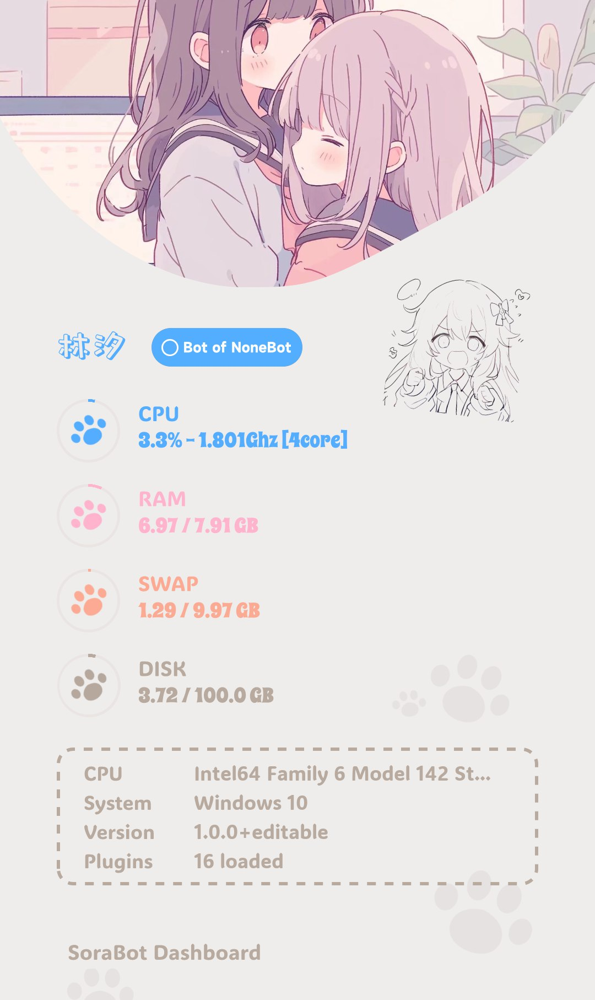

<!-- markdownlint-disable MD033 MD036 MD041 MD045 -->
<div align="center">
  <a href="https://v2.nonebot.dev/store">
    <!--  -->
    
  </a>
  <!-- <br>
  <p>
    
  </p> -->
</div>

<div align="center">

# NoneBot-Plugin-Kawaii-Status

_✨ NoneBot2 服务器状态查看插件 ✨_

<a href="">
  

<a href="https://pdm.fming.dev">
  
</a>
<a href="https://github.com/nonebot/plugin-alconna">
  
</a>

</div>

## 📖 介绍

NoneBot2 服务器状态查看插件

## 💿 安装

以下提到的方法任选 **其一** 即可

<details open>
<summary>[推荐] 使用 nb-cli 安装</summary>
在 Bot 的根目录下打开命令行, 输入以下指令即可安装

```bash
nb plugin install nonebot-plugin-kawaii-status
```
</details>
<details>
<summary>使用包管理器安装</summary>

```bash
pip install nonebot-plugin-kawaii-status
# or, use poetry
poetry add nonebot-plugin-kawaii-status
# or, use pdm
pdm add nonebot-plugin-kawaii-status
```
打开 NoneBot 项目根目录下的配置文件, 在 `[plugin]` 部分追加写入

```toml
plugins = ["nonebot_plugin_kawaii_status"]
```
</details>
  
## ⚙️ 配置

在项目的配置文件中添加下表中的可选配置

| 配置项 | 必填 | 默认值 |
| :---: | :---: | :---: |
| status__to_me | 否 | False |
| status__only_superuser | 否 | False |

## 🎉 使用

> [!note]
> 请注意你的 `COMMAND_START` 以及上述配置项。

指令名：`status` `状态` `运行状态`

### 效果图



## 鸣谢

- [`SoraBot`](https://github.com/netsora/SoraBot)：基于 Nonebot2 开发，互通多平台，超可爱的林汐酱 ~~（自产自销）~~

## 许可证

本项目使用 [MIT](./LICENSE) 许可证开源

```txt
THE SOFTWARE IS PROVIDED "AS IS", WITHOUT WARRANTY OF ANY KIND, EXPRESS OR
IMPLIED, INCLUDING BUT NOT LIMITED TO THE WARRANTIES OF MERCHANTABILITY,
FITNESS FOR A PARTICULAR PURPOSE AND NONINFRINGEMENT. IN NO EVENT SHALL THE
AUTHORS OR COPYRIGHT HOLDERS BE LIABLE FOR ANY CLAIM, DAMAGES OR OTHER
LIABILITY, WHETHER IN AN ACTION OF CONTRACT, TORT OR OTHERWISE, ARISING FROM,
OUT OF OR IN CONNECTION WITH THE SOFTWARE OR THE USE OR OTHER DEALINGS IN THE
SOFTWARE.
```
